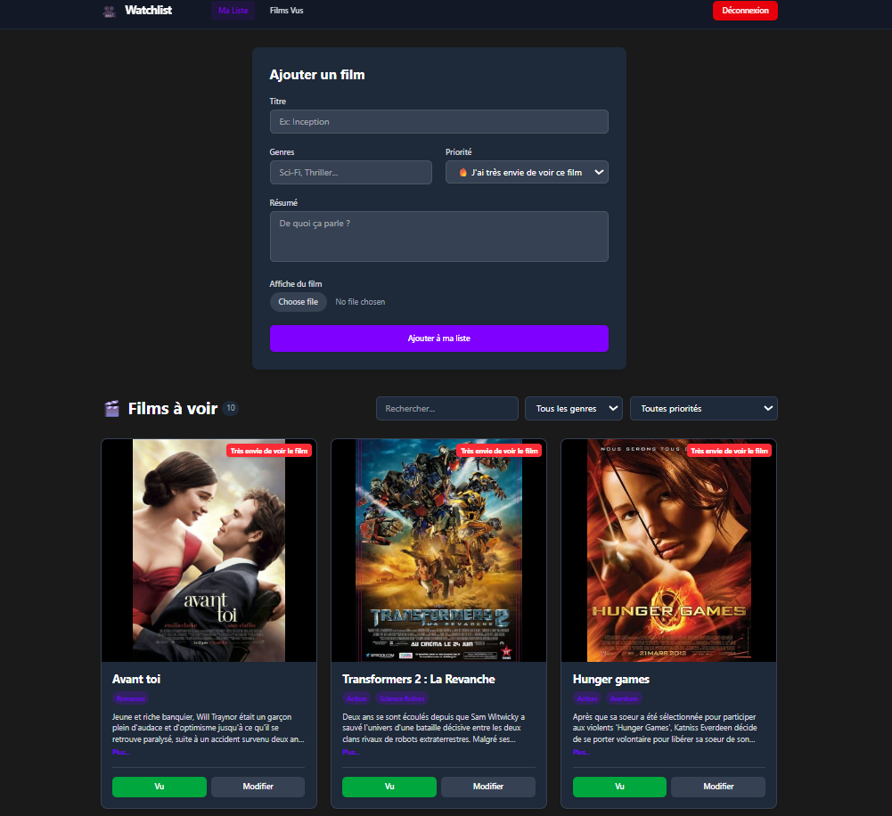
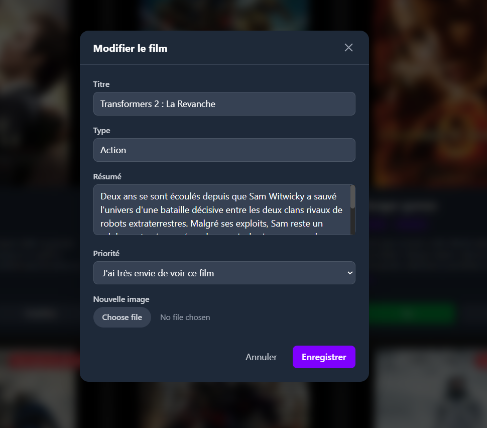
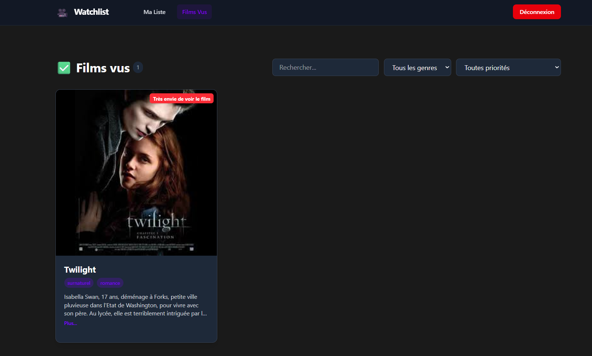
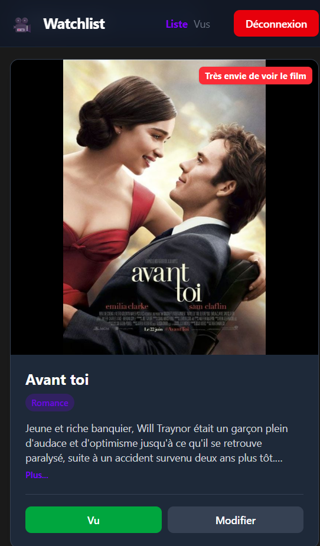

# 🎥 Watchlist

Application moderne de gestion de liste de films ("To Watch List") construite avec React, Vite et Supabase.

## 🌟 Fonctionnalités

*   **Authentification sécurisée** : Connexion via Email/Mot de passe (Supabase Auth).
*   **Gestion de films** :
    *   Ajouter un film avec titre, genre, résumé, priorité et image (upload).
    *   Modifier les informations d'un film existant.
    *   Filtrer les films par titre, genre et priorité.
*   **Suivi de visionnage** :
    *   Marquer un film comme "Vu" ✅ (le déplace vers la liste d'historique).
    *   Consulter l'historique des films vus.
*   **Interface Responsive** : Design moderne et adapté aux mobiles (Tailwind CSS).

## 📸 Aperçu






## 🛠 Technologies

*   **Frontend** : [React 19](https://react.dev/), [Vite](https://vitejs.dev/)
*   **Styling** : [Tailwind CSS 4](https://tailwindcss.com/)
*   **Backend & Base de données** : [Supabase](https://supabase.com/) (PostgreSQL)
*   **Routing** : React Router DOM
*   **Formulaires** : Formik, Yup (validation)
*   **Déploiement** : Vercel

## 🚀 Installation et Démarrage

### Prérequis

*   Node.js (v18+)
*   Compte Supabase

### Étapes

1.  **Cloner le dépôt**
    ```bash
    git clone https://github.com/votre-user/watchlist.git
    cd watchlist
    ```

2.  **Installer les dépendances**
    ```bash
    npm install
    ```

3.  **Configuration d'environnement**
    Créez un fichier `.env` à la racine du projet et ajoutez vos clés Supabase :

    ```env
    VITE_SUPABASE_URL=votre_url_supabase
    VITE_SUPABASE_ANON_KEY=votre_cle_anon_publique
    ```

4.  **Lancer le serveur de développement**
    ```bash
    npm run dev
    ```

    L'application sera accessible sur `http://localhost:5173`.

## 📦 Structure de la Base de Données (Supabase)

Le projet utilise deux tables principales :

*   `films` : Liste des films à voir.
*   `filmsvu` : Historique des films vus.
*   Bucket Storage `films-poster` : Pour stocker les affiches de films.

